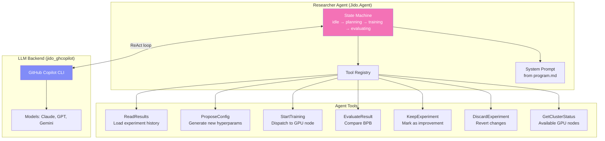
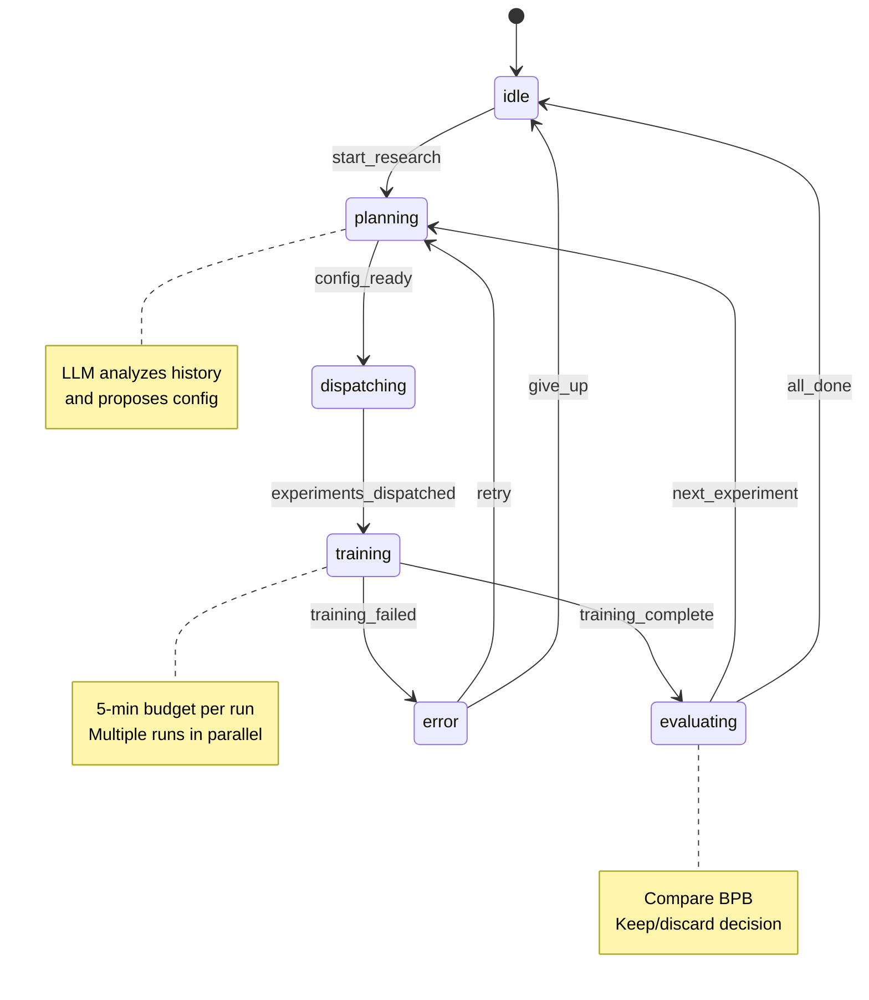
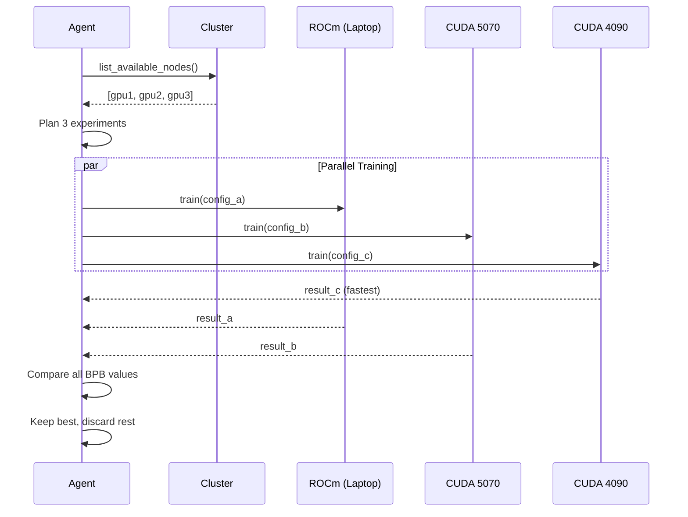

# Agent Loop Design

## Overview

The agent loop is the "brain" of ex_autoresearch. It uses an LLM (GitHub Copilot via `jido_ghcopilot`) to autonomously:

1. Analyze previous experiment results
2. Propose new hyperparameter configurations
3. Dispatch training runs to GPU nodes
4. Evaluate results (BPB metric)
5. Decide whether to keep or discard changes
6. Plan the next experiment

## Agent Architecture



## Agent State Machine



## System Prompt (program.md)

The agent receives a structured prompt adapted from autoresearch's `program.md`:

```markdown
You are an autonomous ML researcher. Your goal is to find the best
GPT model configuration that achieves the lowest validation BPB
(bits per byte) within a 5-minute training budget.

## Available tools:
- ReadResults: Load experiment history from SQLite
- ProposeConfig: Suggest hyperparameter changes
- StartTraining: Dispatch training to a GPU node
- EvaluateResult: Compare BPB against baseline
- GetClusterStatus: See available GPU nodes

## Experiment strategy:
1. Start with the baseline configuration
2. Make ONE change at a time (scientific method)
3. Compare BPB: lower is better
4. If improved, keep as new baseline
5. If worse, discard and try something else

## Hyperparameters you can tune:
- n_layer (depth): 4-16
- aspect_ratio: 32-128 (controls width = depth × ratio)
- n_head / n_kv_head: attention head counts
- learning rates: embedding_lr, matrix_lr, scalar_lr
- batch_size: must fit in GPU VRAM
- weight_decay: 0.0-1.0
- warmup_ratio / warmdown_ratio: LR schedule shape
- window_pattern: attention window pattern (e.g., "SSSL", "SSLL")
```

## GitHub Copilot Integration

`jido_ghcopilot` provides 3 execution modes:

| Mode | Protocol | Use Case |
|------|----------|----------|
| **Simple** | `copilot -p "prompt"` | One-shot config proposals |
| **ACP** | JSON-RPC 2.0 (NDJSON) | Multi-turn reasoning |
| **Server** | JSON-RPC 2.0 (LSP framing) | Full agent loop with tools |

For ex_autoresearch, we use **ACP mode** for multi-turn reasoning:

```elixir
# Start a Copilot session for the researcher agent
{:ok, session} = Jido.GHCopilot.start_session(
  model: "claude-sonnet-4",  # or gpt-4.1, gemini-2.5-pro
  system_prompt: program_md,
  tools: ExAutoresearch.Agent.Tools.definitions()
)

# Send experiment results for analysis
{:ok, response} = Jido.GHCopilot.send_message(session, """
  Previous experiments:
  #{format_results(experiments)}

  Propose the next experiment.
""")
```

## Parallel Experiment Dispatch



## Experiment Persistence (Ash + SQLite)

```elixir
defmodule ExAutoresearch.Research.Experiment do
  use Ash.Resource, domain: ExAutoresearch.Research

  attributes do
    uuid_primary_key :id
    attribute :status, :atom, constraints: [one_of: [:running, :completed, :failed, :discarded]]
    attribute :config, :map        # Full hyperparameter snapshot
    attribute :val_bpb, :float     # Validation bits-per-byte
    attribute :training_seconds, :float
    attribute :peak_vram_mb, :float
    attribute :total_tokens_m, :float
    attribute :num_steps, :integer
    attribute :num_params_m, :float
    attribute :node, :string       # Which GPU node ran this
    attribute :kept, :boolean      # Was this improvement kept?
    attribute :reasoning, :string  # LLM's reasoning for this experiment
    attribute :parent_id, :uuid    # Previous experiment this built on
    timestamps()
  end
end
```

## PubSub Events

The agent and trainer communicate via Phoenix PubSub:

| Topic | Event | Payload |
|-------|-------|---------|
| `training:*` | `:step` | `%{step, loss, lr, tokens_per_sec}` |
| `training:*` | `:complete` | `%{experiment_id, val_bpb, stats}` |
| `training:*` | `:failed` | `%{experiment_id, error}` |
| `agent:*` | `:planning` | `%{reasoning}` |
| `agent:*` | `:decided` | `%{experiment_id, kept, reasoning}` |
| `cluster:*` | `:node_joined` | `%{node, capabilities}` |
| `cluster:*` | `:node_left` | `%{node}` |

The LiveView dashboard subscribes to these topics for real-time updates.

## Why Not Oban for Training Dispatch?

Oban (with Lite/SQLite engine) runs only on the main node — worker BEAM nodes can't poll a file-based SQLite DB. More importantly, the experiment loop is **agent-driven**, not queue-driven: each experiment depends on the previous result, so there's no independent work to enqueue.

**Training dispatch uses:**
- Jido.Agent state machine for orchestration
- `:rpc.call` / `Task.async` to GPU nodes via distributed Erlang
- `Cluster.best_node_for(:train)` for routing

**Oban is used for:** data downloads, periodic cleanup, and other ancillary background tasks that don't require cross-node distribution.
