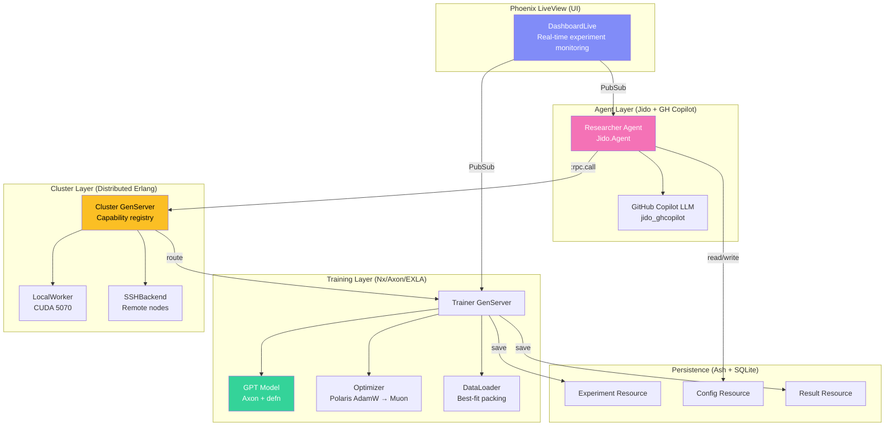
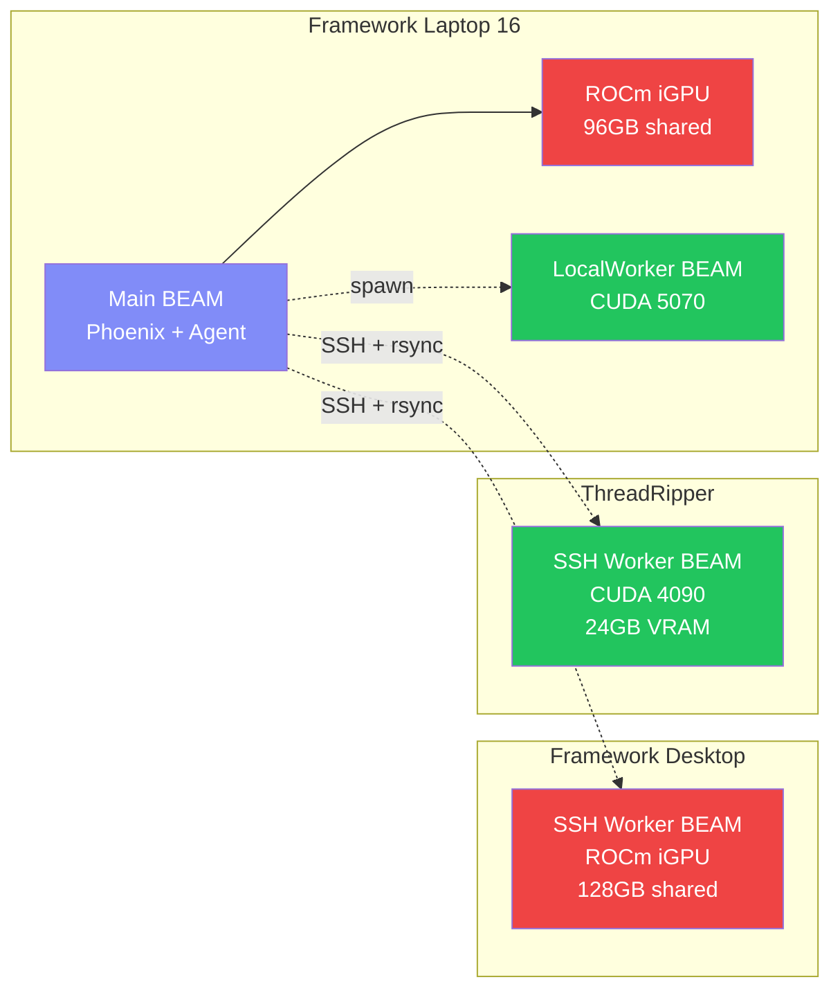
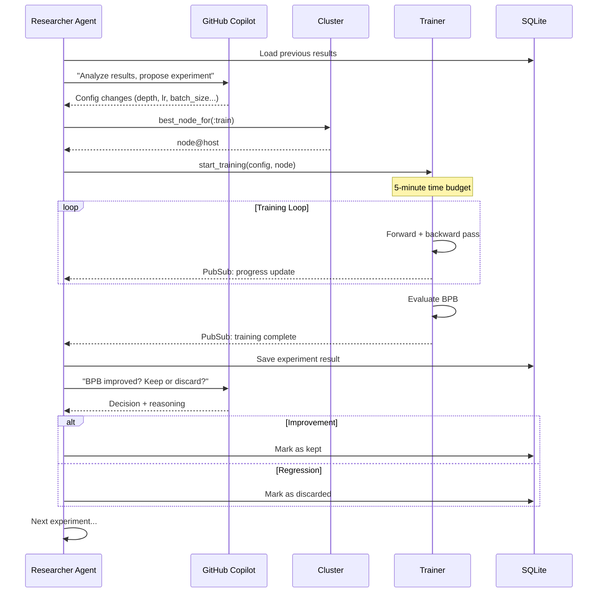
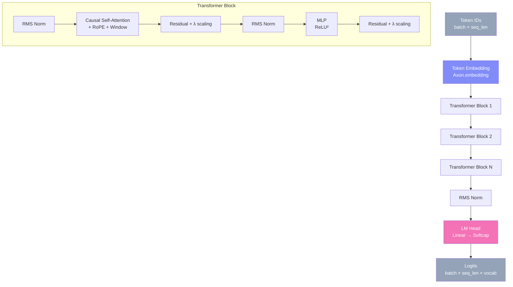

# ex_autoresearch Architecture

## Overview

An Elixir port of Karpathy's [autoresearch](https://github.com/karpathy/autoresearch) — an autonomous AI research framework that lets LLM agents conduct hyperparameter tuning and architectural experimentation on a GPT language model overnight.

## System Architecture



## Distributed GPU Cluster



## Experiment Loop



## GPT Model Architecture (Axon)



## Key Dependencies

| Layer | Package | Purpose |
|-------|---------|---------|
| **GPU Backend** | `xla_rocm` (path dep) | EXLA with CUDA 12.8 + ROCm 7.2 support |
| **Tensors** | `nx ~> 0.10` | Numerical computing |
| **Compiler** | `exla ~> 0.10` | XLA JIT compilation to GPU |
| **Model** | `axon` | Neural network definition |
| **Optimizer** | `polaris` | AdamW (+ custom Muon later) |
| **Agent** | `jido` + `jido_ghcopilot` | LLM agent loop via GitHub Copilot |
| **Persistence** | `ash` + `ash_sqlite` | Experiment tracking |
| **UI** | Phoenix LiveView | Real-time dashboard |
| **Jobs** | Oban (Lite/SQLite) | Ancillary tasks only (data downloads, cleanup) |
| **Cluster** | Distributed Erlang | Multi-node GPU coordination |

## Directory Structure

```
lib/
├── ex_autoresearch/
│   ├── application.ex              # OTP supervision tree
│   ├── repo.ex                     # SQLite repo
│   │
│   ├── model/                      # GPT model (Axon/Nx)
│   │   ├── gpt.ex                  # Full GPT model assembly
│   │   ├── attention.ex            # Causal self-attention + RoPE
│   │   ├── mlp.ex                  # MLP block (ReLU²)
│   │   └── config.ex               # GPTConfig struct
│   │
│   ├── training/                   # Training loop
│   │   ├── trainer.ex              # GenServer: time-budgeted training
│   │   ├── optimizer.ex            # AdamW / Muon setup
│   │   ├── scheduler.ex            # LR warmup/warmdown
│   │   └── metrics.ex              # BPB evaluation
│   │
│   ├── data/                       # Data pipeline
│   │   ├── tokenizer.ex            # BPE tokenizer wrapper
│   │   ├── loader.ex               # Best-fit packing dataloader
│   │   └── downloader.ex           # HuggingFace parquet download
│   │
│   ├── research/                   # Ash domain: experiment tracking
│   │   ├── research.ex             # Ash domain
│   │   ├── experiment.ex           # Ash resource: experiment runs
│   │   └── config_snapshot.ex      # Ash resource: hyperparameter snapshots
│   │
│   ├── agent/                      # LLM agent loop
│   │   ├── researcher.ex           # Jido.Agent: experiment orchestrator
│   │   ├── tools.ex                # Agent tools (train, evaluate, git)
│   │   └── program.ex              # System prompt from program.md
│   │
│   └── cluster/                    # Multi-GPU coordination
│       ├── cluster.ex              # Capability registry GenServer
│       ├── local_worker.ex         # Same-machine second BEAM
│       ├── ssh_backend.ex          # Remote BEAM via SSH
│       └── network.ex              # IP detection
│
├── ex_autoresearch_web/
│   ├── live/
│   │   └── dashboard_live.ex       # Main experiment dashboard
│   ├── router.ex
│   └── ...
│
├── config/
│   ├── config.exs                  # EXLA backend, Oban queues
│   └── runtime.exs                 # GPU_TARGET switching
│
└── docs/
    ├── architecture.md             # This file
    ├── training.md                 # GPT training details
    ├── agent.md                    # Agent loop design
    └── cluster.md                  # Distributed GPU setup
```
