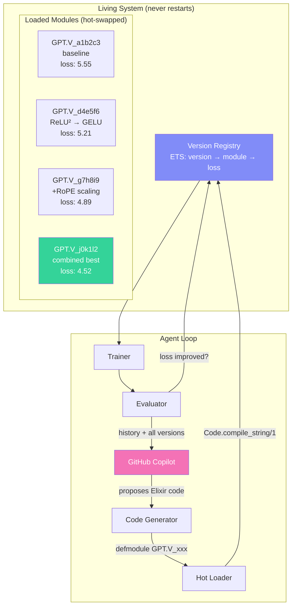
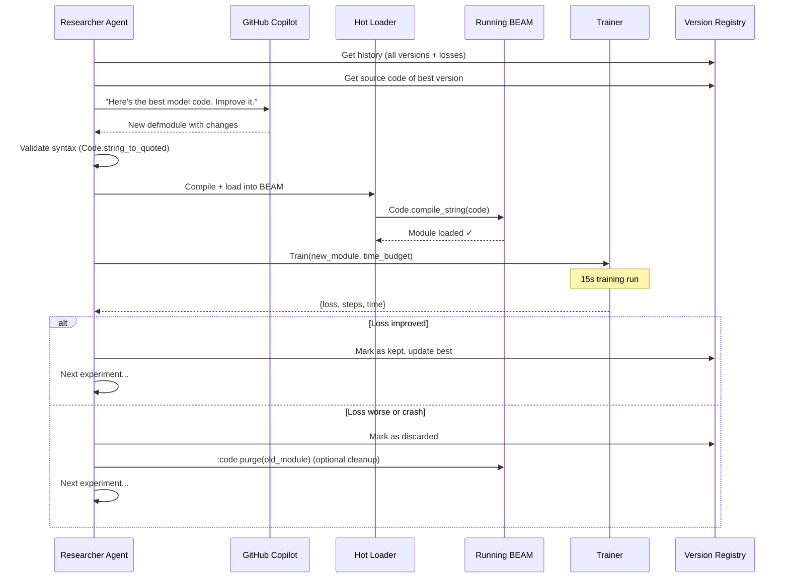

# BEAM-Native Autoresearch: The Self-Optimizing Training Loop

## The Insight

Karpathy's autoresearch has the LLM edit `train.py`, commit, run, evaluate, keep/revert.
We can do something **fundamentally better** on the BEAM.

Instead of editing files on disk and restarting, we:
1. Generate **versioned Elixir modules** with unique names
2. **Hot-load** them into the running BEAM (no restart)
3. Run experiments against any loaded version
4. Keep a **living registry** of all versions — the best ones survive
5. The LLM can reference and combine ideas from any previous version

This is evolution, not iteration.

## Architecture



## How Versioned Modules Work

Each experiment produces a module with a unique version name:

```elixir
# The LLM generates this — it's a complete, self-contained model definition
defmodule ExAutoresearch.Experiments.V_a1b2c3 do
  @moduledoc "Baseline: 2L×32d, ReLU², standard attention"
  
  import Nx.Defn

  def config do
    %{n_layer: 2, n_embd: 32, n_head: 2, vocab_size: 256, seq_len: 32}
  end

  def build do
    # Returns an Axon model — the LLM can change ANYTHING here
    input = Axon.input("input_ids", shape: {nil, 32})
    x = Axon.embedding(input, 256, 32)
    x = transformer_block(x, 0)
    x = transformer_block(x, 1)
    x = Axon.layer_norm(x, epsilon: 1.0e-6)
    Axon.dense(x, 256, use_bias: false)
  end

  defp transformer_block(x, i) do
    # ... full implementation
  end

  # The LLM can also define custom loss, optimizer, data preprocessing
  def loss_fn(y_pred, y_true) do
    Axon.Losses.categorical_cross_entropy(y_pred, y_true,
      from_logits: true, reduction: :mean)
  end

  def optimizer do
    Polaris.Optimizers.adamw(learning_rate: 0.01)
  end
end
```

The next version can change anything — architecture, activation, optimizer, loss:

```elixir
defmodule ExAutoresearch.Experiments.V_d4e5f6 do
  @moduledoc "Try GELU instead of ReLU², wider MLP"
  
  # ... completely different implementation
  # The LLM has full creative freedom
end
```

## The Version Registry

```elixir
# ETS table tracking all loaded experiment versions
%{
  "v_a1b2c3" => %{
    module: ExAutoresearch.Experiments.V_a1b2c3,
    loss: 5.55,
    steps: 8000,
    description: "baseline",
    parent: nil,
    kept: true,
    loaded_at: ~U[2026-03-13 16:00:00Z],
    code: "defmodule ExAutoresearch.Experiments.V_a1b2c3 do\n..."
  },
  "v_d4e5f6" => %{
    module: ExAutoresearch.Experiments.V_d4e5f6,
    loss: 5.21,
    steps: 9200,
    description: "GELU instead of ReLU²",
    parent: "v_a1b2c3",
    kept: true,
    loaded_at: ~U[2026-03-13 16:05:00Z],
    code: "defmodule ExAutoresearch.Experiments.V_d4e5f6 do\n..."
  }
}
```

## The Experiment Loop



## What the LLM Sees

The system prompt includes:

1. **The source code of the current best version** — so it knows exactly what to change
2. **The experiment history** — what worked, what didn't, by how much
3. **The source code of notable past versions** — so it can combine ideas
4. **The rules** — editable .md files in priv/prompts/

```markdown
## Current best (loss: 4.52)

```elixir
defmodule ExAutoresearch.Experiments.V_j0k1l2 do
  # ... full source code
end
```

## Recent experiments

| Version | Loss | Description | Status |
|---------|------|-------------|--------|
| v_j0k1l2 | 4.52 | combined: GELU + RoPE scaling | ✅ kept |
| v_m3n4o5 | 4.71 | tried SwiGLU activation | ❌ discarded |
| v_g7h8i9 | 4.89 | added RoPE frequency scaling | ✅ kept |
| v_d4e5f6 | 5.21 | GELU instead of ReLU² | ✅ kept |
| v_a1b2c3 | 5.55 | baseline | ✅ kept |

Propose a new version. Output a complete defmodule.
```

## Prompt Management

Prompts live as `.md` files, editable from the LiveView UI:

```
priv/prompts/
├── system.md        # Core identity and rules
├── strategy.md      # Experiment strategy (one change at a time, etc.)
├── constraints.md   # What the LLM can/can't change
└── template.md      # Module template with required callbacks
```

The agent composes these into the full prompt. The LLM can even propose changes
to strategy.md — meta-optimization of its own research process.

## Safety

1. **Syntax validation** — `Code.string_to_quoted/1` before loading
2. **Sandbox** — modules must be under `ExAutoresearch.Experiments.*` namespace
3. **Required callbacks** — `build/0`, `config/0`, `optimizer/0` must exist
4. **Timeout** — training has a hard wall-clock budget
5. **Crash isolation** — training runs in a Task, crashes don't kill the system
6. **All versions preserved** — source code stored in registry + SQLite
7. **Revert is free** — just load the previous module, it's still in the BEAM

## Why This Is Better Than File Editing

| Aspect | File editing (Python) | Hot-loaded modules (BEAM) |
|--------|----------------------|--------------------------|
| Restart needed | Yes (every experiment) | Never |
| Concurrent versions | 1 (current file) | All loaded simultaneously |
| Rollback | git reset | Already loaded, instant |
| Compare versions | git diff | Call any version's build/0 |
| A/B testing | Not possible | Run 2 versions in parallel |
| Crash recovery | Process dies | Supervisor restarts, old module still loaded |
| History | git log | Registry + source in memory |
| Combine ideas | Manual | LLM sees all version source code |
