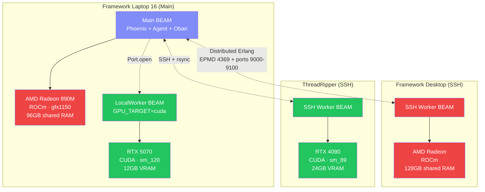
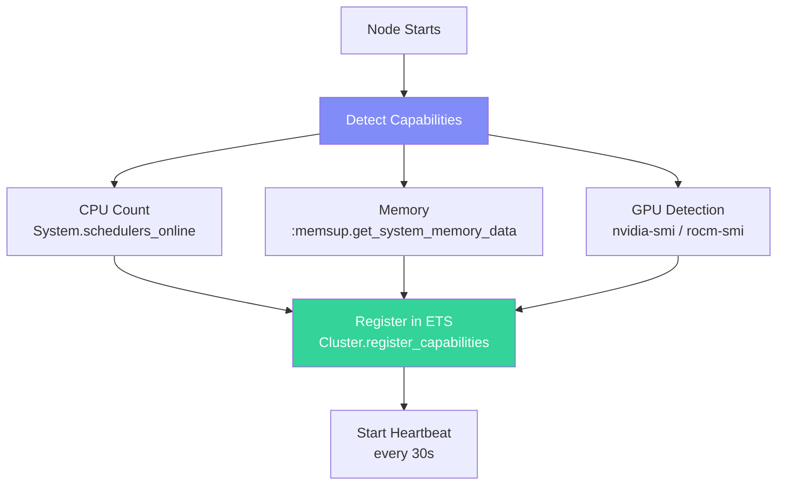

# Distributed GPU Cluster

## Overview

ex_autoresearch distributes training across multiple GPU nodes using distributed Erlang. This pattern is proven in the [basileus](https://github.com/chgeuer/basileus) project for ebook classification workloads.

## Hardware Setup



## Node Types

### Main Node

The laptop runs the main BEAM with all services:
- Phoenix LiveView dashboard
- Researcher agent (Jido + Copilot)
- Oban job queue coordinator
- Cluster GenServer (capability registry)
- ROCm training (on iGPU)

### LocalWorker Node

A second BEAM on the same machine using a different GPU backend:

```bash
# Pre-compile for CUDA target
XLA_TARGET=cuda MIX_BUILD_PATH=_build/cuda mix compile

# Main node spawns it automatically:
Basileus.Cluster.LocalWorker.start_link(
  name: "cuda",
  gpu_target: "cuda",
  build_path: "_build/cuda"
)
```

**Constraint:** ROCm and CUDA EXLA cannot coexist in one BEAM process (C++ linker collisions). The LocalWorker pattern solves this.

### SSH Worker Node

Remote machines join the cluster via SSH:

```elixir
Basileus.Cluster.SSHBackend.start_link(
  host: "192.168.1.170",       # ThreadRipper IP
  ssh_user: "chgeuer",
  gpu_target: "cuda",
  node_name: "threadripper"
)
```

This:
1. `rsync`s compiled `.beam` files to the remote host
2. Generates a `boot.exs` script
3. Starts a remote BEAM via `ssh -tt`
4. The remote node connects back to the main node via distributed Erlang

## Capability Detection



Each node auto-detects and registers:

```elixir
%{
  "cpu_count" => 16,
  "memory_gb" => 96.0,
  "gpu" => ["NVIDIA GeForce RTX 5070"],
  "gpu_target" => "cuda",
  "supported_tasks" => ["train"],
  "vram_mb" => 12288
}
```

## Task Routing

```elixir
# The cluster picks the best node for training:
case Cluster.best_node_for(:train) do
  {:ok, node} ->
    # Dispatch training to that node
    :rpc.call(node, ExAutoresearch.Training.Trainer, :start, [config])

  {:error, :no_available_node} ->
    # Queue for later
    {:error, :no_gpu_available}
end
```

### Routing Strategy for Training

Priority order:
1. **Discrete GPU with most VRAM** (4090 = 24GB > 5070 = 12GB)
2. **iGPU with most shared RAM** (desktop 128GB > laptop 96GB)
3. **Fewest active jobs** (load balancing)

## Network Requirements

| Port | Service | Required Between |
|------|---------|-----------------|
| 4369 | EPMD (Erlang Port Mapper) | All nodes |
| 9000-9100 | Erlang distribution | All nodes |
| 22 | SSH (for SSHBackend) | Main → remote nodes |
| 5432/5433 | PostgreSQL (if using shared DB) | All nodes → DB host |

## EXLA Configuration Per Node

```elixir
# config/runtime.exs
gpu_target = System.get_env("GPU_TARGET", "host")

config :nx, default_backend: {EXLA.Backend, client: String.to_atom(gpu_target)}
config :nx, default_defn_options: [compiler: EXLA, client: String.to_atom(gpu_target)]

config :exla, :clients,
  host: [platform: :host],
  cuda: [platform: :cuda, preallocate: true],
  rocm: [platform: :rocm, preallocate: false]  # false for iGPU (shared RAM)
```

**Important:** `preallocate: false` for iGPU to avoid freezing the OS by claiming all shared memory.

## xla_rocm Integration

The project depends on [xla_rocm](https://github.com/chgeuer/xla_rocm) for GPU support:

```elixir
# mix.exs
xla_rocm_archive_url =
  "https://github.com/chgeuer/xla_rocm/releases/download/v0.9.2-rocm/..."

unless System.get_env("XLA_BUILD") do
  System.put_env("XLA_ARCHIVE_URL", xla_rocm_archive_url)
  System.put_env("XLA_TARGET", System.get_env("XLA_TARGET") || "cuda")
end
```

### Building for Multiple Targets

```bash
# Default target (CUDA for 5070)
mix compile

# Build for ROCm (on machines with AMD GPU)
XLA_TARGET=rocm MIX_BUILD_PATH=_build/rocm mix compile

# Build for CUDA (on machines with NVIDIA GPU)
XLA_TARGET=cuda MIX_BUILD_PATH=_build/cuda mix compile
```

## Scaling Benefits

| Metric | Single GPU (Python) | Distributed (Elixir) |
|--------|--------------------|--------------------|
| Experiments per 5 min | 1 | 3-4 |
| Overnight (10 hours) | ~120 | ~360-480 |
| Fault tolerance | Process dies | OTP restarts node |
| Adding a GPU | Rewrite code | `SSHBackend.start_link(host: ...)` |
| Mixed GPU types | Not supported | ROCm + CUDA in same cluster |
