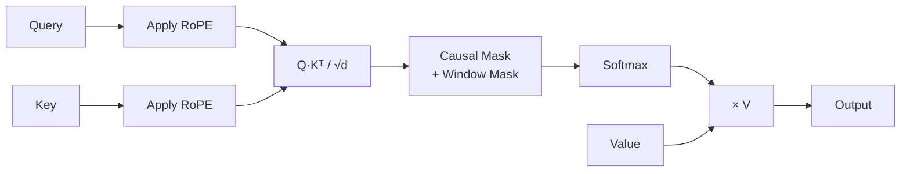
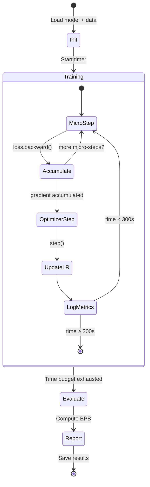

# GPT Training in Nx/Axon

## What We're Porting

The original `train.py` implements a GPT language model with these components:

| Component | Python | Elixir Target |
|-----------|--------|---------------|
| Model definition | `nn.Module` subclasses | `Axon` functional API |
| Forward pass | PyTorch autograd | `Nx.Defn` compiled functions |
| GPU compilation | `torch.compile` | EXLA JIT (automatic) |
| Mixed precision | `torch.amp.autocast(bf16)` | `Nx.Type` bf16 tensors |
| Optimizer | Custom MuonAdamW | Polaris AdamW → custom Muon |
| Data loading | Custom best-fit packing | GenServer + Nx tensors |
| Evaluation | BPB metric | Custom `defn` |

## Model Architecture

### GPTConfig

```elixir
defmodule ExAutoresearch.Model.Config do
  defstruct [
    sequence_len: 2048,
    vocab_size: 8192,
    n_layer: 8,
    n_head: 6,
    n_kv_head: 6,
    n_embd: 768,
    window_pattern: "SSSL",   # S=short window, L=full
    aspect_ratio: 64,         # n_embd = n_layer * aspect_ratio
    head_dim: 128
  ]
end
```

### Attention with RoPE



**Rotary Position Embeddings** encode position information by rotating Q and K vectors:

```elixir
defn apply_rotary_emb(x, cos, sin) do
  # Split into pairs, rotate, recombine
  {x0, x1} = split_pairs(x)
  rotated = Nx.concatenate([
    x0 * cos - x1 * sin,
    x0 * sin + x1 * cos
  ], axis: -1)
  rotated
end
```

### Sliding Window Attention

The pattern `"SSSL"` means:
- Layers 1-3: **Short** window (half context = 1024 tokens)
- Layer 4: **Long** window (full context = 2048 tokens)
- Last layer: always full attention

This reduces compute while maintaining long-range dependencies.

### MLP with ReLU²

```elixir
# Standard: GELU activation
# Autoresearch: ReLU² = relu(x)²
defn relu_squared(x) do
  x |> Nx.max(0) |> Nx.pow(2)
end
```

## Training Loop



### Time Budget

The training loop runs for exactly **5 minutes (300 seconds)** wall-clock time. This makes experiments directly comparable regardless of model size or batch configuration.

### Gradient Accumulation

```
TOTAL_BATCH_SIZE = 2^19 = 524,288 tokens per optimizer step
DEVICE_BATCH_SIZE = 128 sequences × 2048 tokens = 262,144 tokens per micro-step
grad_accum_steps = 524,288 / 262,144 = 2 micro-steps per optimizer step
```

For GPUs with less VRAM (4090 = 24GB), reduce DEVICE_BATCH_SIZE and increase accumulation steps.

## BPB Evaluation

**Bits Per Byte (BPB)** is a vocabulary-size-independent metric:

```
BPB = total_cross_entropy_nats / (ln(2) × total_utf8_bytes)
```

- Lower is better
- Measures compression efficiency in bits per byte of text
- Unlike perplexity, fair across different tokenizers/vocab sizes

## Optimizer Strategy

### Phase 1: AdamW (Initial)

Standard AdamW from Polaris with per-parameter-group learning rates:

| Parameter Group | Learning Rate |
|----------------|---------------|
| Token embeddings | 0.6 |
| LM head (unembedding) | 0.004 |
| Attention/MLP matrices | 0.04 |
| Per-layer scalars | 0.5 |

### Phase 2: Muon (Advanced)

Custom Polaris-compatible optimizer implementing:
- **Polar Express orthogonalization** for 2D matrix parameters
- **NorMuon** variance reduction per dimension
- Separate handling of 2D (matrices) vs 1D (biases, scalars) parameters
- Momentum warmup: 0.85 → 0.95 over 300 steps

## Known Limitations vs Python

| Feature | Python (PyTorch) | Elixir (Nx/EXLA) |
|---------|-----------------|-------------------|
| Flash Attention 3 | ✅ Custom CUDA kernels | ❌ Standard O(n²) attention |
| Muon optimizer | ✅ Built-in | ⏳ Must implement custom |
| torch.compile | ✅ JIT fusion | ✅ EXLA JIT (different approach) |
| Memory management | ✅ Fine-grained CUDA control | ⚠️ EXLA manages automatically |
| Training speed | Baseline | ~3-5x slower (no FA3) |

### Mitigation: Parallel experiments

While each training run is slower, the distributed cluster runs **3-4 experiments simultaneously** across GPU nodes, achieving comparable or better overnight throughput.
