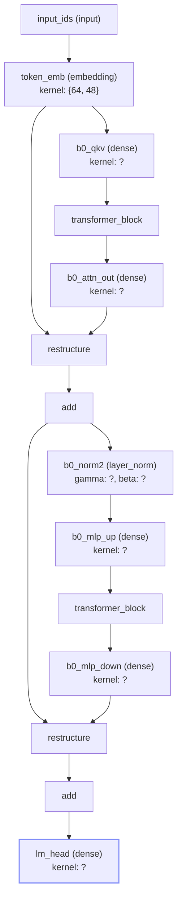

# 🏆 Best Experiment: v_najvrm8

| Metric | Value |
|--------|-------|
| **Loss** | 1.551846944494173e-4 |
| **Steps** | 50000 |
| **Training time** | 37.5s |
| **Campaign** | mar15-debug2 |
| **GPU** | unknown |
| **Model** | claude-sonnet-4 |
| **Step budget** | 50000 |

## Configuration

```elixir
%{
  batch_size: 8,
  n_embd: 48,
  n_layer: 1,
  vocab_size: 64,
  sequence_len: 20,
  n_head: 2,
  n_kv_head: 2,
  head_dim: 24
}
```

## Description

Reduce attention heads from 3 to 2 while keeping the successful Swish activation and RMSprop optimizer from v_57tke68: 1 transformer layer, embedding dimension 48, batch_size 8, vocab_size 64, sequence_len 20, 4x MLP expansion, Swish activation, RMSprop learning rate 0.008, no layer norm before atte

## Reasoning

Reduce attention heads from 3 to 2 while keeping the successful Swish activation and RMSprop optimizer from v_57tke68: 1 transformer layer, embedding dimension 48, batch_size 8, vocab_size 64, sequence_len 20, 4x MLP expansion, Swish activation, RMSprop learning rate 0.008, no layer norm before attention, pre-norm before MLP, no final layer norm - testing if fewer attention heads can maintain performance while reducing computational complexity


## Source Code

```elixir
defmodule ExAutoresearch.Experiments.V_najvrm8 do
  @moduledoc "Reduce attention heads from 3 to 2 while keeping the successful Swish activation and RMSprop optimizer from v_57tke68: 1 transformer layer, embedding dimension 48, batch_size 8, vocab_size 64, sequence_len 20, 4x MLP expansion, Swish activation, RMSprop learning rate 0.008, no layer norm before attention, pre-norm before MLP, no final layer norm - testing if fewer attention heads can maintain performance while reducing computational complexity"

  import Nx.Defn

  def config do
    %{
      n_layer: 1,
      n_embd: 48,
      n_head: 2,
      n_kv_head: 2,
      head_dim: 24,
      vocab_size: 64,
      sequence_len: 20,
      batch_size: 8
    }
  end

  def build do
    config = config()
    input = Axon.input("input_ids", shape: {nil, config.sequence_len})

    x = Axon.embedding(input, config.vocab_size, config.n_embd, name: "token_emb")

    x =
      Enum.reduce(0..(config.n_layer - 1), x, fn i, acc ->
        transformer_block(acc, config, i)
      end)

    # No final layer norm - direct to output projection
    Axon.dense(x, config.vocab_size, use_bias: false, name: "lm_head")
  end

  defp transformer_block(x, config, i) do
    # Direct Attention → Residual (no pre-norm)
    attn =
      x
      |> Axon.dense(config.n_embd * 3, use_bias: false, name: "b#{i}_qkv")
      |> Axon.nx(fn qkv -> simple_causal_attention(qkv, config.n_head, config.n_embd) end)
      |> Axon.dense(config.n_embd, use_bias: false, name: "b#{i}_attn_out")

    x = Axon.add(x, attn)

    # Pre-norm → MLP → Residual (4x expansion)
    normed = Axon.layer_norm(x, name: "b#{i}_norm2", epsilon: 1.0e-6)

    mlp =
      normed
      |> Axon.dense(4 * config.n_embd, use_bias: false, name: "b#{i}_mlp_up")
      |> Axon.nx(fn x -> Nx.multiply(x, Axon.Activations.sigmoid(x)) end)  # Swish/SiLU activation
      |> Axon.dense(config.n_embd, use_bias: false, name: "b#{i}_mlp_down")

    Axon.add(x, mlp)
  end

  defp simple_causal_attention(qkv, n_head, n_embd) do
    head_dim = div(n_embd, n_head)
    {batch, seq_len, _} = Nx.shape(qkv)

    q = qkv[[.., .., 0..(n_embd - 1)//1]] |> Nx.reshape({batch, seq_len, n_head, head_dim})
    k = qkv[[.., .., n_embd..(2 * n_embd - 1)//1]] |> Nx.reshape({batch, seq_len, n_head, head_dim})
    v = qkv[[.., .., (2 * n_embd)..(3 * n_embd - 1)//1]] |> Nx.reshape({batch, seq_len, n_head, head_dim})

    q = Nx.transpose(q, axes: [0, 2, 1, 3])
    k = Nx.transpose(k, axes: [0, 2, 1, 3])
    v = Nx.transpose(v, axes: [0, 2, 1, 3])

    scale = Nx.rsqrt(Nx.tensor(head_dim, type: :f32))
    scores = Nx.dot(q, [3], [0, 1], k, [3], [0, 1]) |> Nx.multiply(scale)

    # Causal mask: prevent attending to future tokens
    rows = Nx.iota({seq_len, 1})
    cols = Nx.iota({1, seq_len})
    mask = Nx.select(Nx.greater(cols, rows), Nx.Constants.neg_infinity(:f32), 0.0)
    scores = Nx.add(scores, mask)

    weights = Axon.Activations.softmax(scores, axis: -1)
    out = Nx.dot(weights, [3], [0, 1], v, [2], [0, 1])

    out |> Nx.transpose(axes: [0, 2, 1, 3]) |> Nx.reshape({batch, seq_len, n_head * head_dim})
  end

  def optimizer do
    Polaris.Optimizers.rmsprop(learning_rate: 0.008)
  end
end
```

## Architecture Diagram



